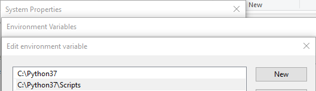

######Neural Singularity - A Deep Learning Course
# Lesson 01
How to write a simple AI image recognizer in your browser

This lesson will teach you how to create a state-of-art image classifier from scratch. We would not be training a neural network, so you do not need any fancy GPU to recognize and classify simple images.

The setup we will be focusing on will be for windows environment. Other operating systems will have roughly similar steps.

##Installing Python
Deep learning relies on well-written and well-optimized frameworks that do the heavy lifting. One of the biggest advantage of python is its simplicity and when it comes to deep learning, a lot of high quality and mature frameworks are already available. So unless you want to reinvent the wheel, Python is the way to go.
> Navigate to https://www.python.org/downloads/ and download the latest version for Python 7 (yes not 8)

Install python (standard setup should be fine). Make sure you have added python and its script folder to the PATH variable in your environment.

1. Open **Windows Explorer**
2. right click on **This PC**
3. Click on **Properties**
4. In the System Home, click on **Advanced system settings** on the left
5. In the **System Properties**, click on **Advanced tab**
6. Click on **Environment Variables...** button to open the **Environment Variables settings** window.
7. Add python installation folder and script (inside python folder) to the PATH

##Installing PyTorch
PyTorch is one of the best libraries to do deep learning in.
 
To install PyTorch libraries head over to [pytorch.org](http://www.pytorch.org) and click on **Getting Started** at the top. 

If you know you have a CUDA enabled graphics card select the latest CUDA library (10.2) other wise None is fine for what we are doing. Make sure you select the Pip package for now (we'll deal with Conda in later session as it is a better option).

Once you have selected the options that apply to you copy the command/text infront of **Run this Command:**

Open a windows terminal / CMD prompt window, paste the command and press enter. Leave the command prompt open, we'll need it to run other commands. 

If you get an error **'pip' is not recognized as an internal or external command**, you have not setup the environment variables correctly (see previous step). 

Command should be something similar to the following
> pip install torch==1.6.0+cpu torchvision==0.7.0+cpu -f https://download.pytorch.org/whl/torch_stable.html

##Install Streamlit
Streamlit is an open source app framework that builds app/UI for your program so that you can focus on doing data science.

Run the following command in CMD prompt window
>pip install streamlit

## Let's Code
We are now ready to do some actual coding in python. If you not familiar with programing or with python, search for some basic tutorials on python. It is really easy to pickup and you'll have a good time coding with it.

Just before we start code we need to download a helper file (we'll understand what it is for later). Download and save the following json file in the same directory where you will save your python file: [imagenet_class_index.json](https://s3.amazonaws.com/deep-learning-models/image-models/imagenet_class_index.json)

Open your favorite text editor or just notepad (I use notepad++) and save the text file to any name like **lesson01.py**. But make sure the filename _ends with py extension and no spaces in the filename_ either.

Let's start with importing the important libraries. Copy all the subsequent code to the file.

    # Web application framework
    import streamlit as st
    # deep learning library
    import torch
    # pretrained models
    from torchvision import models, transforms
    # handle image files
    from PIL import Image
    # decode json files
    import json
    # one of the best libraries for handling data and analysis
    import pandas as pd
    
    # get around the file encoder warning
    st.set_option('deprecation.showfileUploaderEncoding', False)

Read the comments above each line of code to understand why it is needed.
Do not worry about the last line, it just gets rid of an annoying warning message (you might not even need it).

    # import pretrained ResNet model
    model = models.resnet34(pretrained=True);

The above command will download a pretrained model that is the literally brains of this operation. ResNet is a neural network structured in a unique way. Currently it is one of the best architectures in recognizing images.
If you research inclined, read the [original paper](https://arxiv.org/abs/1512.03385).

The model is able to recognize about 1000 different objects (like cards, busses, breeds of dogs etc). We'll feed the model an image and the model will output a number that corresponds to one of these objects. To convert the number to an actual label we use a mapping (json downloaded earlier).

    # get labels for each of the categories recognized by the model
    class_idx = json.load(open("imagenet_class_index.json"))
    labels = [class_idx[str(k)][1] for k in range(len(class_idx))]

The model expects images in a certain size/format. To do that we use the following transformations.

    # modify the image to what the model expects
    transform = transforms.Compose([
        transforms.Resize(256),
        transforms.CenterCrop(224),
        transforms.ToTensor(),
        transforms.Normalize(
            mean=[0.485, 0.456, 0.406],
            std=[0.229, 0.224, 0.225]
        )])
 
Following will appear at the top of the web page as instructions for the user.
 
    '''
    # Image Recognizer
    
    Click on browse files to load an image file.
    The machine will then try to determine what is in the image.'
    '''
    f'Total Number of identified categories: {len(labels)}'

At this point we can run the program to see how it looks. You will also see the power of streamlit. In the command program navigate to the directory where you have saved the python file. Run the following command.
>streamlit run main.py

If you have change the filename, change the above command accordingly. After running the command, it should provide you with a link to where you can see your application. Copy that link (should look something like below) and run it in your browser.
>http://localhost:8501

Your browser page will look something like this:

This is where you'll the power of streamlit. You do not need to run any command any more or even refresh the browser.

Streamlit will do it for you. Now every time you make changes to your python file and save, the code be run and you will see changes automatically on the browser.

Just make sure you select Always rerun on the top right of the browser page (appears when you change and save your python file).

Rest of the code:

    # streamlit widget to show open file dialog
    file_name = st.file_uploader('', type=['jpeg','jpg','png','jfif'])
    # if file selected
    if file_name is not None:
        # open the image file
        img = Image.open(file_name)
        # show the image on the browser
        st.image(img, width=512)
        
        # modify the image to fit as an input to the model
        img_t = transform(img)
        batch_t = torch.unsqueeze(img_t, 0)
    
        # run the model to predict what object is in the image
        model.eval()
        out = model(batch_t);
        _, index = torch.max(out, 1)
        # calculate how confident is the model about its prediction
        percentage = torch.nn.functional.softmax(out, dim=1)[0] * 100

        # show the predictions
        _, indices = torch.sort(out, descending=True)
        df = pd.DataFrame([(labels[idx], percentage[idx].item()) for idx in indices[0][:5]], columns=['Label', 'Confidence'])
        df.index = df.index + 1; df

Read through the comments to see what each line of the code does.

Essentially, we are doing the following:
1. Display an open image file dialog widget. This is where the user will select the image file it wants recognized.
2. We are going to modify the image for to conform to the specification of what the model expects the image to be.
3. Open the file an pass it to the ResNet model. The model will then make predictions on what is in the image file.
4. Lastly we display the top 5 predictions of the model and how confident it is about them.
5. Now save the file and see the changes on the browser (make sure to select always rerun option on top left of the browser).
6. Click on browse files button on the web page and open a image file. In a few seconds you should be able to see the predictions.

You will soon realize that it cannot recognize a lot of objects (it only knows about a thousand categories).

In the next lesson we will expand the models vision repertoire to recognize objects, that we care about, but it cannot classify.

Till then play with the code and have fun.

:pray:
_Bhupen_
